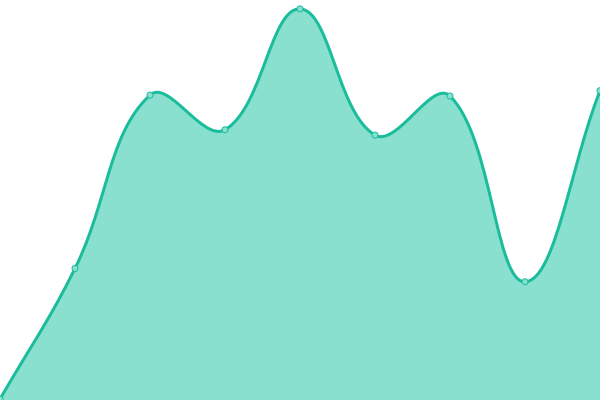

# [📈 Live Status](https://demo.upptime.js.org): <!--live status--> **🟥 Complete outage**

This repository contains the open-source uptime monitor and status page for [DreadPirateRoberts](https://demo.upptime.js.org), powered by [Upptime](https://github.com/upptime/upptime).

With [Upptime](https://upptime.js.org), you can get your own unlimited and free uptime monitor and status page, powered entirely by a GitHub repository. We use [Issues](https://github.com/ManfredRichthofen/Uptime-Monitor/issues) as incident reports, [Actions](https://github.com/ManfredRichthofen/Uptime-Monitor/actions) as uptime monitors, and [Pages](https://demo.upptime.js.org) for the status page.

<!--start: status pages-->
<!-- This summary is generated by Upptime (https://github.com/upptime/upptime) -->
<!-- Do not edit this manually, your changes will be overwritten -->
<!-- prettier-ignore -->
| URL | Status | History | Response Time | Uptime |
| --- | ------ | ------- | ------------- | ------ |
|  [Home Page](https://home.jfapp.xyz) | 🟥 Down | [home-page.yml](https://github.com/ManfredRichthofen/Uptime-Monitor/commits/HEAD/history/home-page.yml) | 

 549ms
     
 | 

<a href="https://status.jfapp.xyz/history/home-page">95.15%</a>
    

|  [Jellyfin](https://jfapp.xyz) | 🟥 Down | [jellyfin.yml](https://github.com/ManfredRichthofen/Uptime-Monitor/commits/HEAD/history/jellyfin.yml) | 

 342ms
     
 | 

<a href="https://status.jfapp.xyz/history/jellyfin">95.20%</a>
    

|  [Movie Requests](https://requests.jfapp.xyz) | 🟥 Down | [movie-requests.yml](https://github.com/ManfredRichthofen/Uptime-Monitor/commits/HEAD/history/movie-requests.yml) | 

 3043ms
     
 | 

<a href="https://status.jfapp.xyz/history/movie-requests">95.46%</a>
    

|  [Movie Downloader](https://dl.jfapp.xyz) | 🟥 Down | [movie-downloader.yml](https://github.com/ManfredRichthofen/Uptime-Monitor/commits/HEAD/history/movie-downloader.yml) | 

 265ms
     
 | 

<a href="https://status.jfapp.xyz/history/movie-downloader">95.49%</a>
    

|  [Invites](https://invite.jfapp.xyz) | 🟥 Down | [invites.yml](https://github.com/ManfredRichthofen/Uptime-Monitor/commits/HEAD/history/invites.yml) | 

 262ms
     
 | 

<a href="https://status.jfapp.xyz/history/invites">92.96%</a>
    

<!--end: status pages-->

[**Visit our status website →**](https://demo.upptime.js.org)

## 📄 License

- Powered by: [Upptime](https://github.com/upptime/upptime)
- Code: [MIT](./LICENSE) © [DreadPirateRoberts](https://demo.upptime.js.org)
- Data in the `./history` directory: [Open Database License](https://opendatacommons.org/licenses/odbl/1-0/)
